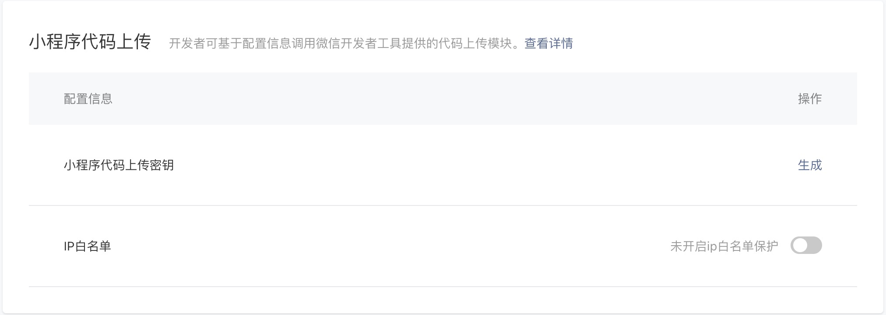

### 安装
```
npm install wx-mini-ci --save-dev
```
或
```
yarn add wx-mini-ci --save-dev
```
github下载了仓库代码的话,创建全局软连接
```javascript
yarn link 或 npm link
```
开发完成关闭软连接
```javascript
yarn unlink mini 或 npm unlink mini
```
### 项目配置
在项目根目录添加ci.config.js配置文件
```javascript
module.exports = {
    appid: 'wxe848c704ff29506e',
    projectPath: './', // uni-app编译后路径
    keyPath: './private.upload.key', // 上传授权KEY
    qrcodeOutput: './dist/qrcode.jpg',
    maxVersionNum: 5, // test|demo|prod每个环境至多留存10个版本
    build: false, // 是否需要编译 原生小程序不需要编译，需要编译的话写上编译的话，设置为true(目前默认为uni-app编译命令)
};
```
进入微信公众平台 - 开发 - 开发管理



生成private.upload.key文件保存到根目录

设置上传IP白名单或者直接关掉IP白名单验证

### 开发调试
**开发者工具调试**

修改_config.js文件SEVER_ENV变量为test

打开微信开发者工具预览和调试

**真机预览**

```mini preview [env]```

生成二维码qrcode.jpg文件到根目录下的/dist文件夹

### 发布
1、提交MR到develop或master

2、执行```mini tag [env]```命令，完成选择发布环境、发布分支、更新类型、更新描述命令行交互

3、执行```mini upload [env]```上传

4、小程序公众平台设置为体验版本或提审


